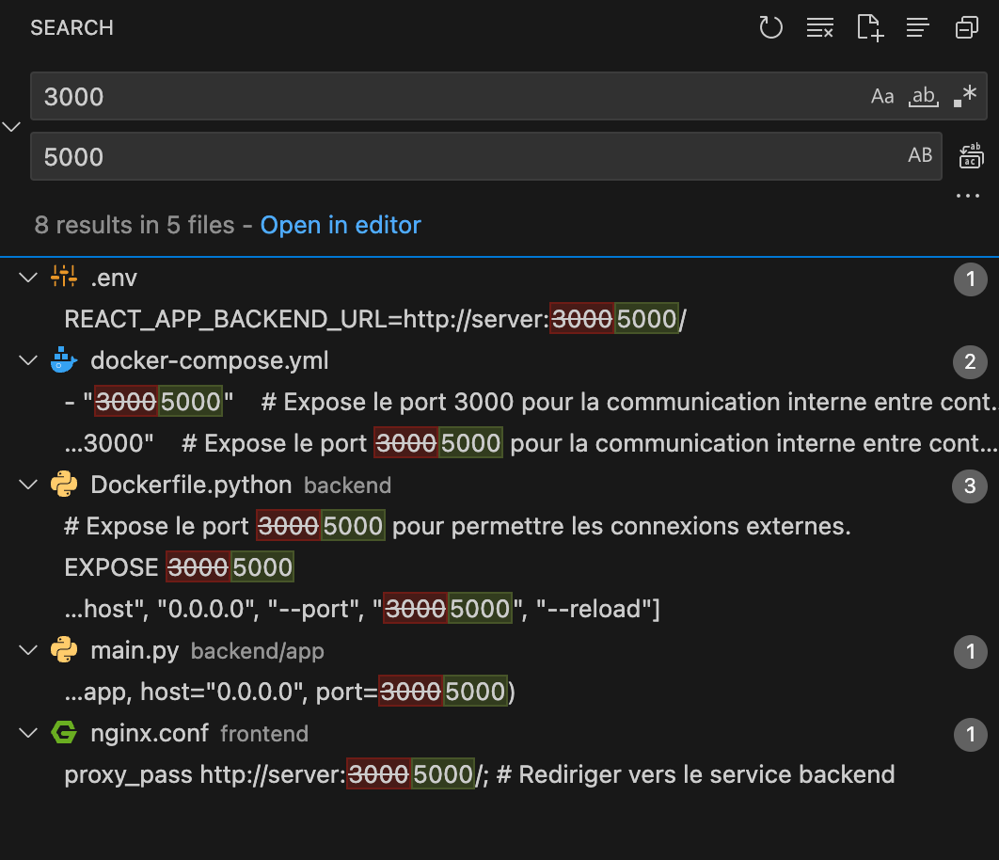

# README

## Projet Final : Application en Microservices avec Docker

<p align="center">
  
</p>

---

## Informations sur le Projet

- **Membres du groupe :**
  - BRASSÉ Nathan
  - VIDOUZE Paul
  - PHAM Nguyen Hoang Tung

- **Classe :** 4A FISA | TD 44 | TC 2  
- **Matière :** Conteneurisation
- **Professeur :** TAOUALIT Madjid

---

## Description

Ce projet est une application web composée de plusieurs microservices conteneurisés avec Docker. Initialement basée sur l'application à Dockeriser du Lab6, cette application a été enrichie pour devenir une marketplace de jeux vidéos en ligne. Les utilisateurs peuvent ajouter, modifier, consulter et supprimer des jeux. Elle inclut également une fonctionnalité de filtrage par **nom**, **prix** et **genre**.

### Composants du Projet
- **Backend** : Une API REST développée avec **FastAPI** pour gérer une base de données MySQL.
- **Base de données** : **MySQL** pour stocker et gérer les informations sur les jeux.
- **Frontend** : Une interface utilisateur responsive construite avec **HTML**, **CSS**, et **JavaScript**.
- **Proxy** : **Nginx** configuré pour servir les fichiers statiques du frontend et relayer les requêtes vers l'API backend.
- **Orchestration** : **Docker Compose** pour automatiser le déploiement de l'application.

---

## Fonctionnalités

### Backend
L'API REST offre les fonctionnalités suivantes :  
- **Ajouter un jeu (POST)** : Ajouter un jeu en spécifiant son nom, son prix, et son genre.  
- **Récupérer la liste des jeux (GET)** : Obtenir tous les jeux enregistrés avec des options de filtrage.  
- **Modifier un jeu (PUT)** : Mettre à jour les informations d’un jeu existant.  
- **Supprimer un jeu (DELETE)** : Supprimer un jeu à partir de son identifiant unique.  

### Frontend
Le frontend inclut :  
- **Ajout de jeux** : Formulaire dynamique avec validation pour ajouter des jeux.  
- **Affichage des jeux** : Liste des jeux avec mise en page optimisée et options de tri/filtrage.  
- **Suppression des jeux** : Bouton de suppression avec confirmation utilisateur.  

### Proxy Nginx
- **Fichiers statiques** : Sert les fichiers HTML/CSS/JS pour le frontend.  
- **Redirection** : Relaye les requêtes du frontend vers l’API backend.  

---

## Structure du Projet
```plaintext
project/
│
├── assets/               # Captures d’écran et autres ressources visuelles
│   ├── backend-curl.png
│   ├── frontend-edit.png
│   ├── frontend-filter.png
│   ├── frontend-main.png
│   └── frontend-phpadmin.png
│
├── backend/
│   ├── app/              # Code source du backend
│   │   └── main.py       # Point d'entrée de l'API
│   ├── Dockerfile.python # Conteneurisation du backend
│   └── requirements.txt  # Dépendances Python
│
├── frontend/
│   ├── src/              # Code source du frontend
│   │   ├── index.html    # Page HTML de l'application
│   │   ├── styles.css    # Feuilles de style CSS
│   │   ├── script.js     # Logique de l'application
│   │   ├── code.jquery.com_jquery-3.7.1.min.js  # Bibliothèque jQuery
│   │   └── jquery.form.js        # Gestion des formulaires avec jQuery
│   ├── nginx.conf        # Fichier de configuration du serveur nginx
│   └── Dockerfile.nginx  # Conteneurisation du frontend
│
├── database/
│   ├── init.sql          # Script d'initialisation de la base de données
│   └── Dockerfile.mysql  # Conteneurisation de la base de données
│
├── .env                  # Fichier des variables d'environnements
├── docker-compose.yml    # Orchestration des services
└── README.md             # Documentation du projet
```

---

## Variables d’Environnement

Pour des raisons de **sécurité**, les paramètres sensibles (comme les mots de passe) sont définis dans le fichier `.env`. Un exemple de fichier `.env` est déjà inclus dans ce projet. Vous pouvez le modifier pour personnaliser les valeurs selon vos besoins.

### Exemple de contenu `.env`
```env
  # MySQL Configuration
  MYSQL_ROOT_PASSWORD=root
  MYSQL_DATABASE=mydatabase
  MYSQL_USER=user
  MYSQL_PASSWORD=user

  # PhpMyAdmin Configuration
  PMA_HOST=database
  PMA_USER=user
  PMA_PASSWORD=user

  # Node.js API Configuration
  DB_HOST=database
  DB_USER=user
  DB_PASSWORD=user
  DB_NAME=mydatabase

  # React Front-End Configuration # Attention, si vo
  REACT_APP_BACKEND_URL=http://server:3000/
```

>   [!WARNING]
>
>   ⚠️ **Modifications de Port**
>
>   -   **Problème :** Si le port `3000` (défini dans `REACT_APP_BACKEND_URL`) est déjà utilisé sur votre machine, vous pouvez modifier le port, par exemple vers `5000`.
>   -   **Impact :** Si vous changez ce port dans `.env`, **vous devez également mettre à jour toutes les configurations correspondantes** pour assurer une bonne communication entre le frontend, le backend et le proxy Nginx.
>
>   ##### Étapes pour gérer les modifications de port :
>
>   1.  **Changer le port dans `.env`** :
>
>       ```env
>       REACT_APP_BACKEND_URL=http://server:5000/
>       ```
>
>   2.  **Mettre à jour les fichiers de configuration** :
>
>       -   **Docker Compose** : Dans le fichier `docker-compose.yml`, vérifiez les ports exposés pour le service backend.
>
>           Exemple :
>
>           ```yaml
>           expose:
>             - "5000:5000"
>           ```
>
>       -   **Proxy Nginx** : Dans `nginx.conf`, remplacez toutes les occurrences de `3000` par `5000`
>
>           Exemple :
>
>           ```nginx
>           location /api/ {
>             proxy_pass http://server:5000;
>           }
>           ```
>
>       -   **Backend** : `main.py`, `Dockerfile.python`. Vérifiez si des ports spécifiques y sont définis.
>       
>           Exemple:
>       
>           ```python
>           # main.py
>           uvicorn.run(app, host="0.0.0.0", port=5000)
>           
>           # Dockerfile.python
>           
>           EXPOSE 5000
>           CMD ["uvicorn", "app.main:app", "--host", "0.0.0.0", "--port", "5000", "--reload"]
>           ```
>       
>           
>
>   **Bonne pratique ✅ Utilisation d’un IDE pour accélérer les changements** :
>   Au lieu de modifier manuellement chaque fichier, utilisez la fonction **find/replace** de votre IDE (comme VS Code, PyCharm, ou autre) pour rechercher toutes les occurrences de `3000` et les remplacer par `5000`.
>
>   
>
>   3.   **Redémarrer les services** :
>         Après les modifications, reconstruisez les conteneurs pour appliquer les changements.

---

## Prérequis

- **Docker** version 20.10 ou plus récent.  
- **Docker Compose** :
  - **v1.x** : Utilisez `docker-compose`.  
  - **v2.x ou supérieur** : Utilisez `docker compose` (sans tiret).  
- Un navigateur web moderne pour accéder au frontend.  

---

## Installation et Exécution

1. Clonez le dépôt :  
   ```bash
   git clone <url-du-repo>
   cd project
   ```

2. Configurez vos variables d'environnement en éditant le fichier `.env` selon vos besoins.

3. Construisez les images Docker :  
   - **Pour Docker Compose v1** :  
     ```bash
     docker-compose build
     ```
   - **Pour Docker Compose v2 ou supérieur** :  
     ```bash
     docker compose build
     ```

4. Lancez les services :  
   - **Pour Docker Compose v1** :  
     ```bash
     docker-compose up
     ```
   - **Pour Docker Compose v2 ou supérieur** :  
     ```bash
     docker compose up
     ```

5. Accédez aux services :  
   - **Frontend** : [http://localhost:80](http://localhost:80)  
   - **PhpMyAdmin** : [http://localhost:8080](http://localhost:8080)  

6. Nettoyez l'environnement :  
   - **Pour Docker Compose v1** :  
     ```bash
     docker-compose down
     ```
   - **Pour Docker Compose v2 ou supérieur** :  
     ```bash
     docker compose down
     ```

---

## Endpoints de l’API

| Méthode | Endpoint          | Description                        |
|---------|-------------------|------------------------------------|
| POST    | `/add`            | Ajouter un nouveau jeu.            |
| GET     | `/games`          | Récupérer tous les jeux.           |
| PUT     | `/update/{id}`    | Modifier un jeu existant.          |
| DELETE  | `/delete/{id}`    | Supprimer un jeu par son identifiant.|

---

## Captures d'Écran

### Frontend
#### Interface Principale


#### Filtrage des Jeux


#### Modification d'un Jeu


#### PhpMyAdmin


### Backend (Exemple avec curl)

